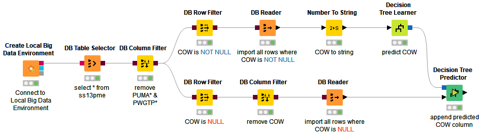
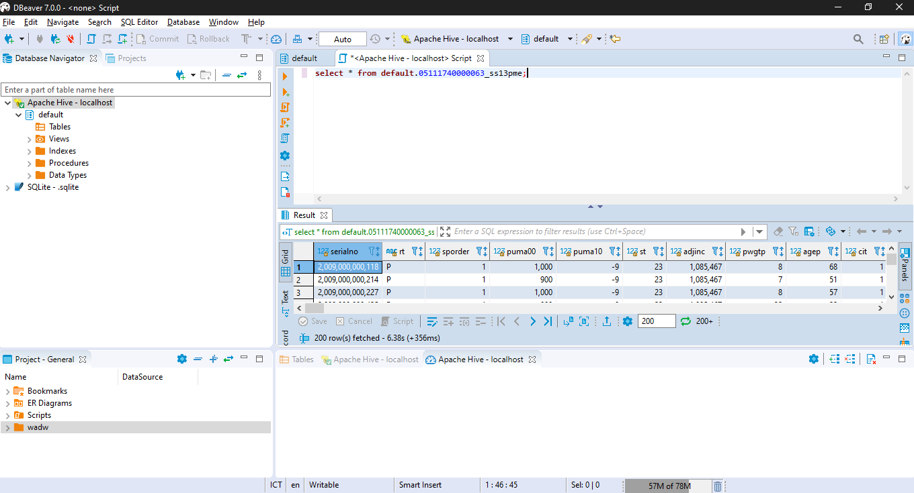
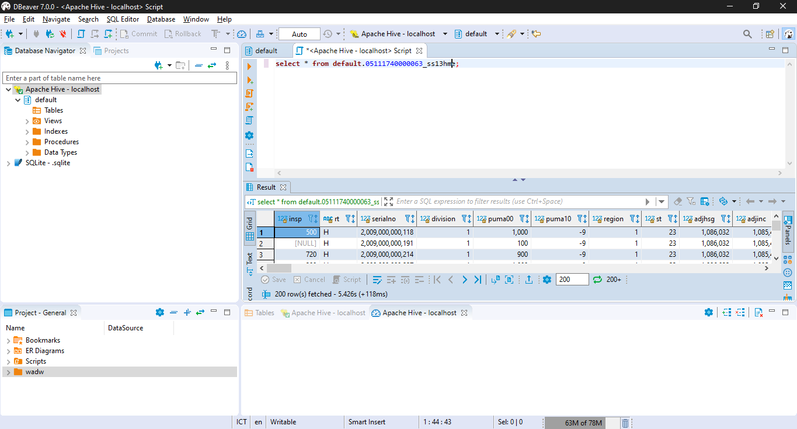
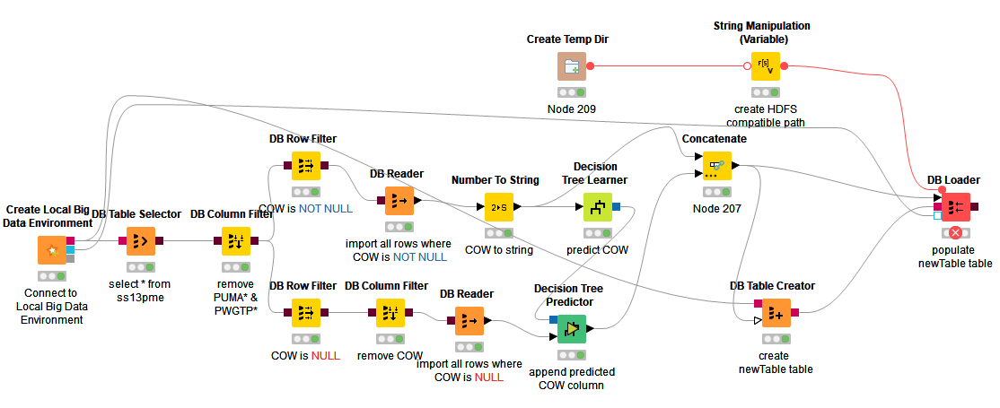
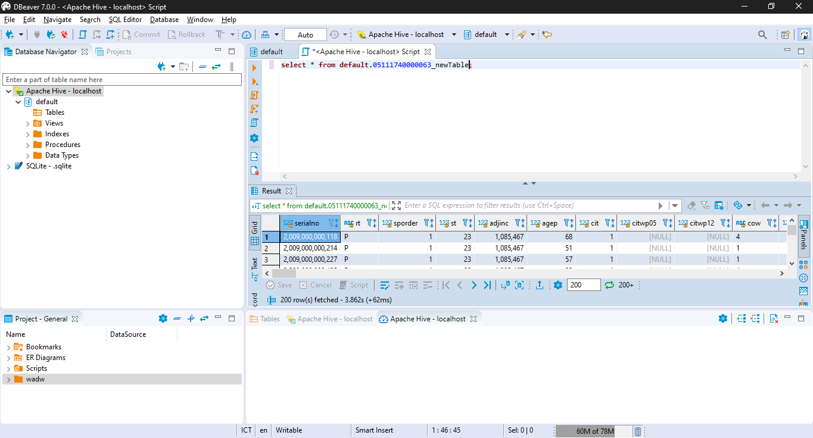

# Bigdata_Tugas2

* DB

    ## 01_DB_Connect_Exercise

    - Tambahkan SQlite Connector 
    * -atur agar sqlite file menjadi sqlite yang telah didownload
    - Tambahkan DB Table selector 
    * -pilih table ss13pme
    - Tambahkan DB Reader
    - execute

    final workflow:
    

    ## 02_DB_InDB_Processing_Exercise

    - Tambahkan DB Column Filter
        * -atur table ss13pme sebagai input
        * -atur kolom puma* dan pwgtp* agar tereksklusi
    - Tambahkan DB Joiner
        * -atur mode menjadi inner join
        * -atur DB Column filter dan tabel ss13hme sebagai input
    - Tambahkan DB Reader
        * -atur DB Joiner sebagai input
    - Tambahkan DB Row Filter
        * -atur DB Column Filter sebagai input
        * -atur kondisinya menjadi cow is null
        * -tambahkan DB Reader untuk membaca hasil
    - Tambahkan DB Row Filter
        * -atur DB Column Filter sebagai input
        * -atur kondisinya menjadi cow is **not** null
        * -tambahkan DB Reader untuk membaca hasil
    - Tambahkan DB GroupBy
        * -atur DB Column Filter sebagai input
        * -atur sex sebagai group column
        * -tambahkan manual aggregation untuk kolom agep dgn agregasi average
        * -tambahkan manual aggregation untuk kolom agep dgn agregasi kustom (AVG(#COLUMN_NAME# + #SECOND_COLUMN_NAME#))
        * -tambahkan DB Reader untuk membaca hasil
    - Tambahkan DB Sorter
        * -atur DB Column Filter sebagai input
        * -atur sort berdasarkan agep secara descending
        * -tambahkan DB Query untuk melimit hasil query sejumlah 10 baris
        * -tambahkan DB Reader untuk membaca hasil

    final workflow:
    

    ## 03_DB_Modelling_Exercise

    - Tambahkan Decision Tree Learner
        * -atur kolom cow sebagai class column
        * -gunakan gini index
        * -no pruning
        * -check reduced error pruning
        * -atur min numer records per node menjadi 2
        * -atur number records to store for view menjadi 1000
        * -check average split point
        * -atur thread menjadi 8
        * -check skip nominal column ...
    - tambahkan Decision Tree Predictor
        * -atur DB Reader dan DT Learner sebagai input
    - execute

    final workflow:
    

    ## 04_DB_WritingToDB_Exercise

    - Tambahkan node DB Update
        * -Atur identification berdasarkan kolom serialno
        * -Atur update kolom cow

    - Tambahkan row filter
        * -atur column to test menjadi update status
    - Tambahkan DB Writer
        * -atur timestamp dan db connection sebagai input
        * -atur tabel target menjadi NRP_model
   - Tambahkan DB Conncetion Table Writer
        * -atur ss13pme_original sebagai tujuan

    Workflow akhir:
    
    Hasil tabel model pada DBeaver:
    

* Hadoop
  
    
    ## 00_Setup_Hive_Table

     - Pada node-node DB Table Creator dan DB Loader ubah nama table menjadi NRP_[Nama Tabel]
     - execute

    ## 01_Hive_Modeling_Exercise

    - ganti SQLite Connector menjadi Create Local Big Data Environment dari exercise 00
    - ubah table pada DB Table Selector menjadi NRP_ss13pme
    - execute

    final workflow:
    
    hasil tabel pada dbeaver:
    
    

    ## 02_Hive_WritingToDB_Exercise

    - ubah tabel pada DB Table Selector menjadi NRP_ss13pme
    - tambahkan DB Table Creator
        * atur koneksi hive dan concatenate sebagai input
        * atur name table menjadi NRP_newTable
    - tambahkan Create Temp Dir
        * uncheck create temp dir on workflow folder
    - tambahkan String Manipulation (Variable)
        * atur create temp dir sebagai input
        * atur expression menjadi:

                replace(regexReplace($${Stemp_path}$$, "[A-Z]:" ,""), "\\", "/")
    - tambahkan DB Loader
        * atur string manipulation, DB Table Creator, Concatenate, dan koneksi hive seabagai input
        * atur nama table menjadi NRP_newTable
    - execute

    final workflow:
    
    tabel pada dbeaver:
    
